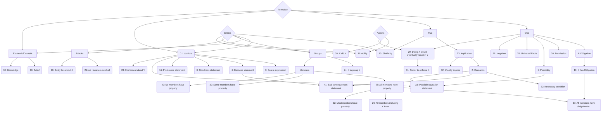

# pattern 0
## examples
- 'I told you …'
## counter-examples:
- URLs
- 'sb. shouted "Britain First"' NOT p0 but normative statement (p3)
- 'I'm like "… blurb …"' NOT p0 but belief (p10)
- threats / warnings (p38)
## notes:
- negations
- nested quotations 
  
# pattern 1
retired
  
# pattern 2
## notes
- counterfactual reasoning
- frequently reasoning about consequences of past events or future results of things
- speculations
- premise sufficient
- often in combination with p5
- basically any implication where there is a reason (not necessarily given) why truth of the antecedent is causing and not just correlating with truth of the consequent

# pattern 3
## notes
- the pattern matches tweets that contain expressions of:
  - desire (*want*, *wish*) of a particular outcome or event,
  - affiliation (*support*, *back*, *say yes to*),
  - conscious decision or reasoning (Johnson's *reason* to remain, her *case* for leave),
  - change in reasoning (he was leave, but has *switched* to remain)
- the entity making the statement should be explicitly marked - an exception applies for ellipsis (i.e. when the subject is not realised in the surface form) and for imperatives. In both of the latter cases, the 'wanter' is understood to be the author of the message
## counter-examples:
- the 'wanter' is implicit in a non-elliptical sentence (*democracy should be protected* pattern 4)
- the desire can only be inferred from a particular action taken by an entity (he *voted* remain might be interpreted as him /remain/ to be made true, but we do not consider such actions a sufficiently clear expression of desire)
- somebody expresses desire towards an item etc.; where we would have to infer that what they actually want is to *obtain* the item

# pattern 4
# pattern 5
# pattern 6
# pattern 7
retired
  
# pattern 8
# pattern 9
retired
  
# pattern 10
# pattern 11
# pattern 12
# pattern 13
retired
## notes
- refers to named points in time (e.g. during "WWII")
- context-dependent variants (next Friday) may be annotated, but cannot be formalized

# pattern 14
retired

# pattern 15
# pattern 16
## notes
- Like in pattern 3, the entity can be left implicit if it is clearly the author of the message, e.g. in elliptical constructions
- a portion of the hits will overlap with pattern 3, as often statements that something should be realised go along with a preference of one outcome over another.
- in addition, 'pure' preference statements that do not indicate a necessary desire for either formula (*direct democracy is better than representative democracy*)
## counter-examples:
- one of the options is implicit (*I prefer brexit*) which is then p3
- the 'formula' part is realised by an entity reference (*I trust men who X, not men who Y*)
- general preferability of a concept over another without ascribing the preference to any entity (*It is better to leave than to remain*: user who posted the tweet prefers leaving over remaining)

# pattern 17
retired

# pattern 18
retired

# pattern 19
# pattern 20
## notes
- the pattern matches instances where an entity is accused of lying about a topic or the truth of a proposition.
	- the formula that is being lied about may be:
	- a particular claim (*For anyone who still believes the enduring Brexit lie* **that the EU is undemocratic** )
	-  a topic (*And believe this man who told lies* **about Iraq**)
	- a claim that is not elaborated upon in the given message, but clearly concerns a particular lie (*@JunckerEU says* **Boris making up stories**)
## counter-examples:
  - the entity is accused of being generally dishonest, without specification of what they were lying about
  - the entity is accused of being unsincere in some other way, e.g. hypocritical, scaremongering...
  - the entity is accused of saying something that is untrue -- it has to be clear from the context that they are deliberately saying something incorrect (e.g. *X is talking BS* is a negative example)

# pattern 21
# pattern 22
# pattern 23
## notes
- no causal implication (in dubio pattern 2)

# pattern 24
# pattern 25
# pattern 26
# pattern 27
# pattern 28
# pattern 29
# pattern 30
# pattern 31
# pattern 32
# pattern 33
# pattern 34
# pattern 35
# pattern 36
# pattern 37
# pattern 38
## notes
- the pattern matches instances of an entity 0 warning about formula 1 being bad.
- negative connotations may be directly encoded in the verb, e.g. 'warn'
- example: *Juncker warns about the outcome of Brexit*
- alternatively, a more neutral communication verb (e.g. say) can be used if formula 1 is clearly inherently negative:
- example: *He said that #brexit will wreck the job market*
## counter-examples:
- neither the verb nor formula 1 show an unambiguously negative evaluation (e.g. *the IMF said that brexit will prolong austerity*)

# pattern 39
# pattern 40
# pattern 41
## notes
- indirect version of p38 where something is claimed to be bad by consequence

# Inverse lookup
![](https://mermaid.ink/svg/eyJjb2RlIjoiZ3JhcGggVERcbiAgICBGe0Zvcm11bGFlfSBcbiAgICBGIC0tPiBPbmVcbiAgICBGIC0tPiBUd29cbiAgICBPbmUgLS0-IE8oNDogT2JsaWdhdGlvbilcbiAgICBPbmUgLS0-IFAoMzY6IFBlcm1pc3Npb24pXG4gICAgT25lIC0tPiBEaWEoNTogUG9zc2liaWxpdHkpXG4gICAgT25lIC0tPiBCb3goMzU6IFVuaXZlcnNhbCBGYWN0cylcbiAgICBUd28gLS0-IEltcGwoMjM6IEltcGxpY2F0aW9uKVxuICAgIEltcGwgLS0-IENhdXMoMjogQ2F1c2F0aW9uKVxuICAgIEltcGwgLS0-IERlZigxMjogVXN1YWxseSBpbXBsaWVzKVxuICAgIE9uZSAtLT4gTmVnKDI3OiBOZWdhdGlvbilcbiAgICBDYXVzIC0tPiBOZWMoMjI6IE5lY2Vzc2FyeSBjb25kaXRpb24pXG5cbiAgICBUd28gLS0-IFNpbSgxNTogU2ltaWxhcml0eSlcbiAgICBFIC0tPiBTaW1cblxuICAgIEV7RW50aXRpZXN9XG5cbiAgICBGIC0tPiBMKDA6IExvY3V0aW9ucylcbiAgICBFIC0tPiBMXG4gICAgTCAtLT4gRCgzOiBEZXNpcmUgZXhwcmVzc2lvbilcbiAgICBMIC0tPiBiYWQoNjogQmFkbmVzcyBzdGF0ZW1lbnQpXG4gICAgYmFkIC0tPiBiYWRjb25zKDQxOiBCYWQgY29uc2VxdWVuY2VzIHN0YXRlbWVudClcbiAgICBDYXVzIC0tPiBiYWRjb25zXG4gICAgTCAtLT4gZ29vZCg4OiBHb29kbmVzcyBzdGF0ZW1lbnQpXG5cbiAgICBGIC0tPiBFRFtFcGlzdGVtaWMvRG94YXN0aWNdXG4gICAgRSAtLT4gRURcbiAgICBFRCAtLT4gQigxMDogQmVsaWVmKVxuICAgIEVEIC0tPiBLKDM0OiBLbm93bGVkZ2UpXG4gICAgTCAtLT4gUHJlZigxNjogUHJlZmVyZW5jZSBzdGF0ZW1lbnQpXG4gICAgTCAtLT4gUENhdXNlKDMzOiBQb3NzaWJsZSBjYXVzYXRpb24gc3RhdGVtZW50KVxuICAgIERpYSAtLT4gUENhdXNlXG4gICAgQ2F1cyAtLT4gUENhdXNlXG4gICAgRSAtLT4gR1tHcm91cHNdXG4gICAgRyAtLT4gSW4oMjQ6IFggaW4gZ3JvdXAgWSlcbiAgICBHIC0tPiBNZW1iZXJzXG4gICAgTWVtYmVycyAtLT4gQWxsKDI1OiBBbGwgbWVtYmVycyBoYXZlIHByb3BlcnR5KVxuICAgIEFsbCAtLT4gQWxsT2JsaWdhdGVkKDM3OiBBbGwgbWVtYmVycyBoYXZlIG9ibGlnYXRpb24gdG8uLi4pXG4gICAgT0QgLS0-IEFsbE9ibGlnYXRlZFxuICAgIEFsbCAtLT4gQWxsS25vdygyNjogQWxsIG1lbWJlcnMgaW5jbHVkaW5nIFgga25vdylcbiAgICBBbGwgLS0-IE1vc3QoMzI6IE1vc3QgbWVtYmVycyBoYXZlIHByb3BlcnR5KVxuICAgIEwgLS0-IEhvbmVzdHkoMjg6IFggaXMgaG9uZXN0IGFib3V0IFkpXG4gICAgTWVtYmVycyAtLT4gU29tZSgzOTogU29tZSBtZW1iZXJzIGhhdmUgcHJvcGVydHkpXG4gICAgTWVtYmVycyAtLT4gTm8oNDA6IE5vIG1lbWJlcnMgaGF2ZSBwcm9wZXJ0eSlcbiAgICBFIC0tPiBBdHRhY2tzXG4gICAgQXR0YWNrcyAtLT4gQWQoMjE6IEFkIEhvbWluZW0gY2F0Y2hhbGwpXG4gICAgQXR0YWNrcyAtLT4gTGkoMjA6IEVudGl0eSBsaWVzIGFib3V0IFgpXG4gICAgTyAtLT4gT0QoMTk6IFggaGFzIE9ibGlnYXRpb24pXG5cbiAgICBBe0FjdGlvbnN9XG5cbiAgICBFIC0tPiBBYmlsaXR5KDExOiBBYmlsaXR5KVxuICAgIEEgLS0-IEFiaWxpdHlcbiAgICBFIC0tPiBEaWQoMzA6IFggZGlkIFkpXG4gICAgQSAtLT4gRGlkXG5cbiAgICBPbmUgLS0-IFJlc3VsdCgyOTogRG9pbmcgWCB3b3VsZCBldmVudHVhbGx5IHJlc3VsdCBpbiBZKVxuICAgIEEgLS0-IFJlc3VsdFxuICAgIFJlc3VsdCAtLT4gU3RyZW5ndGgoMzE6IFBvd2VyIHRvIGVuZm9yY2UgWCkiLCJtZXJtYWlkIjp7InRoZW1lIjoiZGVmYXVsdCJ9LCJ1cGRhdGVFZGl0b3IiOmZhbHNlfQ)

