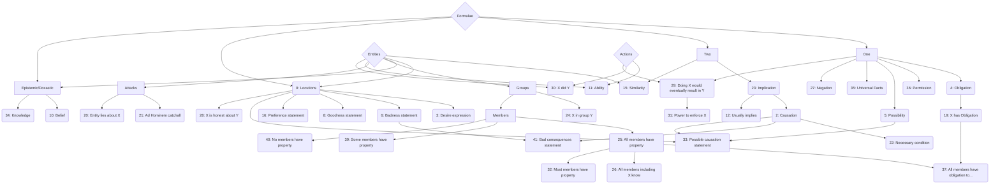

# 0 Quotation #
- ENTITY says FORMULA
- according to ENTITY: FORMULA

## examples ##
- I told you …
- the #UN says that most of them are NOT ' refugees ' at all
- Donald Trump is coming to the UK on June 25th according to this New York Times story

## counter examples ##
- most of them are not refugees
  + missing entity
- URLs

## confusions ##
- #3: sb. shouted "Britain First"
- #10: I'm like "… blurb …"
- #38: threats / warnings

# 2 Causal Implication #
- if FORMULA then FORMULA
- FORMULA would cause FORMULA
- FORMULA is the reason for FORMULA
- counterfactual reasoning
- frequently reasoning about consequences of past events or future results of things
- speculations
- premise sufficient
- often in combination with p5
- basically any implication where there is a reason (not necessarily given) why truth of the antecedent is causing and not just correlating with truth of the consequent

## examples ##
- brexit and we'll have a great relationship with the US
- Zach's relentless negative campaigning brought out the London vote
- Brits will never control our country again if we vote IN

## counter examples ##
- if ever you needed confirmation for Brexit, these three provide it
  + no causal relationship
  
## specifications ##
- #23 + causal relationship

# 3 Desire #
- ENTITY wants FORMULA
- desire (*want*, *wish*) of a particular outcome or event,
- affiliation (*support*, *back*, *say yes to*),
- conscious decision or reasoning (Johnson's *reason* to remain, her *case* for leave),
- the entity making the statement should be explicitly marked - an exception applies for ellipsis (i.e. when the subject is not realised in the surface form) and for imperatives. In both of the latter cases, the 'wanter' is understood to be the author of the message

## examples ##
- SF have issues with EU but see it as better for NI to remain
  because they prefer NI to remain over NI not remaining which is our encoding of desire
- ... says The Times, endorsing Brexit
- I believe in votes at ...

## counter examples ##
- the 'wanter' is implicit in a non-elliptical sentence (*democracy should be protected* pattern 4)
- the desire can only be inferred from a particular action taken by an entity (he *voted* remain might be interpreted as him /remain/ to be made true, but we do not consider such actions a sufficiently clear expression of desire)
- somebody expresses desire towards an item etc.; where we would have to infer that what they actually want is to *obtain* the item
- it would be nice if ..

## specifications ##
- #1 + desire

# 4 Ought #
- ... should / ought ...
- imperatives
- situational oughts (entity should win ...)

## examples ##
- give him enough robe
- @jajyjay1 should be sent straight back and boats destroyed
- we need more fire in our bellies
- our money should all be mini union flags
- it is important to brexit
- entity should win the medal

## counter examples ##
- entity should practice harder

## confusions ##
- #3

# 5 Possibility #
- ... could / would ...

## examples ##
- he could well be the leader of the country
- #indyref2 could change that
- any one of them potentially an EU voter for in

## confusions ##
- #11
- #36

# 6 Bad for Concept #
- FORMULA is / would be bad for ENTITY

## examples ##
- pain would be at least medium term not short
- #RemainCosThePoorAreGonnaBeHitTheHardest
- pensionists stand to lose from Brexit
- Brexit may seem like the West's biggest problem
- Brexit is bad for us

## counter examples ##
- Johnson is a bad person

# 8 Good for Concept #
- FORMULA is / would be good for ENTITY

## examples ##
- the UK will be better of out of the EU
- Brexit might have a positive effect on the EU
- Brexit will only improve things for the minority
- I am ... ejoying following your comments on brexit

## counter examples ##
- Johnson is a good person

# 10 Belief #
- ENTITY believes / thinks FORMULA
- ENTITY is certain / sure that FORMULA

## examples ##
- I'm certain it will break up or change dramatically
- I don't think people realise the severity of the consequences of voting to leave
- I believe they will

## confusions
- #0
- #34: I know it's bad

# 11 Option #
- ENTITY can / is able to ACTION

## examples ##
- we could lend you Gisela Stuart if you like
- if we get out we can decide
- why would we no longer be able to sell them

## counter examples ##
- the sheep can move to Islamabad and take their €€with them
  + hidden imperative
- Remain can't see it
  + the may be able to see it, but they don't want to

### confusions ##
- #36

# 12 Default Implication #
- if FORMULA, then usually FORMULA

## examples ##
- " Every establishment figure " wanting you to vote for something isn't usually a reason to jump to it
- when people say this, they are usually right

## confusions ##
- #23: when people say this, they are right

# 15 Similarity #
- CONCEPT equals CONCEPT

## examples ##
- BREXIT=fREEDOM
- Brexit equals anxiety attack
- Boris Johnson, another Nigel Farage
- #EUref feels similar to Scottish Referendum

## counter examples ##
- there is a link between Brexit and mental illness
  + correlation

# 16 Expressed Preference #
- ENTITY prefers FORMULA over FORMULA
- Like in pattern 3, the entity can be left implicit if it is clearly the author of the message, e.g. in elliptical constructions
- a portion of the hits will overlap with pattern 3, as often statements that something should be realised go along with a preference of one outcome over another.
- in addition, 'pure' preference statements that do not indicate a necessary desire for either formula (*direct democracy is better than representative democracy*)
- change in reasoning (he was leave, but has *switched* to remain)

## examples ##
- a lot fo tories would gladly trade Scotland for Brexit
- it 's all coulds and not woulds , il take my chance with coulds and brexit
- we go for quality rather than quantity

## counter examples ##
- one of the options is implicit (*I prefer brexit*) which is then p3
- the 'formula' part is realised by an entity reference (*I trust men who X, not men who Y*)
- general preferability of a concept over another without ascribing the preference to any entity (*It is better to leave than to remain*: user who posted the tweet prefers leaving over remaining)

## confusions ##
- #43: Brexit would be better for the young folks than staying in the EU

# 19 Entity's Obligation #
- ENTITY should / have FORMULA

## examples ##
- DAVE YOU SHOULD ALSO " QUIT "
- you should get a job there
- the UK should stay in the EU
- @nickhillman You have to read the article.

## confusions ##
- #3: John wants Trump to resign
- #4: A should win the medal

## specifications ##
- #3 + do-modality
- #4 + entity who should make the formula true

# 20 Lying #
- ENTITY lies about FORMULA
- ENTITY says FORMULA; FORMULA is not true
- ENTITY is not honest about FORMULA
- an entity is accused of lying about a topic or the truth of a proposition.
- the formula that is being lied about may be:
  - a particular claim (*For anyone who still believes the enduring Brexit lie* **that the EU is undemocratic** )
  - a topic (*And believe this man who told lies* **about Iraq**)
  - a claim that is not elaborated upon in the given message, but clearly concerns a particular lie (*@JunckerEU says* **Boris making up stories**)

## examples ##
- this lie that young people can't travel, it's another stay lie
- David Cameron and George Osborne’s ‘ lies ’ over Brexit warnings
- @BBCr4today running as its top story a Brexit lie

## counter examples ##
- the entity is accused of being generally dishonest, without specification of what they were lying about
- the entity is accused of being unsincere in some other way, e.g. hypocritical, scaremongering...
- the entity is accused of saying something that is untrue -- it has to be clear from the context that they are deliberately saying something incorrect (e.g. *X is talking BS* is a negative example)

## confusions ##
- #21: more bullshit from the in camp , next they'll be claiming that Brexit ' could ' cause Mars to crash in to Venus lol

## specifications ##
- #21 + special accusation

# 21 Ad Hominem #
- ENTITY is (morally) bad

## examples ##
- he 's been paid off by Brussels to keep us in
- #UK/#EU #PowerElite manipulating/misleading #PublicOpinion on #EURef
- Remain puppets
- more bullshit from the in camp , next they'll be claiming that Brexit ' could ' cause Mars to crash in to Venus lol

## counter examples ##
- cunt.
  + only disqualifying accusations are ad hominem

# 22 Necessary Condition #
- FORMULA is necessary for FORMULA
- FORMULA cannot be done without FORMULA

## examples ##
- that can only be the case if Irish border is closed
- EU membership the only possible way to promote free trade over the long term
- we need brexit to stop unelected buffons to stop interfering with our laws

## confusions ##
- #35

# 23 Implication #
- if FORMULA then FORMULA

## examples ##
- if every you needed confirmation for brexit, these three provide it
- if I was leaning towards BREXIT , their campaign being ran by Farage , Boris & The Sun will give me 2nd thoughts

## counter examples ##
- if every you needed a list what happens if we brexit, it's simple: prices will rise

## confusions ##
- #2: here no causal implication (in dubio pattern 2)

# 24 Membership #
- ENTITY is part of ENTITY GROUP

## examples ##
- The clintons are fat cats who are owned by the multinationals
- you're German
- Jo was a politician
- three parties that want to be in the EU but not in the UK
- star economist Thomas Pickety
- he's a leaver

### counter examples ###
- he supports leave

# 25 Universal Quantification [!] #
- ENTITY is / does something

## examples ##
- The borg don't negotiate
- UKIP are a one trick pony
- we all love and support each other

## counter examples ##
- I don't like this at all

# 26 Position to Know #
- ENTITY is part of a GROUP who is qualified to know FORMULA

## examples ##
- we European knows it and see our culture disappearing

## counter examples ##
- as an immigrant , son of immigrants and having been subject to racsim I am firmly for Brexit

# 27 Negation [!] #

## examples ##
- this is false / this is not true.
- no.
- most of them are NOT ' refugees ' at all

# 30 Action Execution #
- ENTITY have verb'ed

## examples ##
- i've voted brexit
- Ted Heath promised our sovereinty is safe
- EU secured employment rights on a number of occasions
- someone actually done that

## counter examples ##
- I've been in Africa since 1980
  + stative verbs

# 32 Weak Universal Quantification [!] #

## examples ##
- almost all its Units were renamed after Continental European scientists
- most of them are NOT ' refugees ' at all

# 34 Knowledge #
- ENTITY knows FORMULA

## examples ##
- I know that Nigel Farage didn't murder that MP
- Even this Norwegian minister knows that this would not be good for UK
- The pro-EU campaign knows that people don't trust Dodgy Dave

## confusions ##
- #10: ENTITY is certain that FORMULA

# 35 Necessary Truth #
- FORMULA will always be the case

## examples ##
- Europe will always be there
- great ideas will always be funded

## confusions ##
- #22

# 36 Permission #

## examples ##
- I have the right to vote
- it's ok for the INs

# 37 Quotation of Entity's Obligation #

## examples ##
- Billionaire Brexit supporter says UK should emulate Singapore
- Cypriot expat organization in #UK calls on its members to vote #Remain

## specifications ##
- #19 + #0 + #25

# 38 Warning #
- ENTITY warns of FORMULA
- the pattern matches instances of an entity 0 warning about formula 1 being bad.
- negative connotations may be directly encoded in the verb, e.g. 'warn'
- example: *Juncker warns about the outcome of Brexit*
- alternatively, a more neutral communication verb (e.g. say) can be used if formula 1 is clearly inherently negative:
- example: *He said that #brexit will wreck the job market*
- includes ratings of entities i.e. stating that agroup of people are the worst

## examples ##
- Boris Johnson as PM would be ‘ horror scenario , ’ warns top Juncker aide
- Hilary Benn has warned that Britain 's exit from the EU would make the country ' poorer ' and ' less influential'
- Cameron warns against Brexit in patriotic speech

## counter examples ##
- neither the verb nor formula 1 show an unambiguously negative evaluation (e.g. *the IMF said that brexit will prolong austerity*)

# 39 Some [!] #

## specifications ##
- #32 + #27

# 40 Nobody [!] #

## specifications ##
- #25 + #27

# 41 Warning of Bad Consequence #
- FORMULA would lead to bad FORMULA, says ENTITY
- indirect version of p38 where something is claimed to be bad by consequence

## examples ##
- Brexit could lead to downgrades for other EU countries -Fitch
- Brexit ' could extend austerity': IFS

# 42 Better #

## examples ##
- Brexit is still better than being in the EU

# 43 Better for Concept #

## examples ##
- Brexit would be better for the young folks than staying in the EU

# 44 Good #

# 45 Bad #

# 46 Qualified Desire #

# Categories #
- entities vs entity groups
- binders / operators / junctors
- necessary truth

## Binders ##
- 25, 27, 32, 39, 40

## Evaluation ##
- 3, 6, 8, 16, 42, 43, 44, 45, 46

## Implication ##
- 2, 12, 22, 23, 35

## Quotation ##
- 0, 3, 10, 16, 34

## Entities ##
- 19, 20, 21

# Inverse Lookup #
![](https://mermaid.ink/svg/eyJjb2RlIjoiZ3JhcGggVERcbiAgICBGe0Zvcm11bGFlfSBcbiAgICBGIC0tPiBPbmVcbiAgICBGIC0tPiBUd29cbiAgICBPbmUgLS0-IE8oNDogT2JsaWdhdGlvbilcbiAgICBPbmUgLS0-IFAoMzY6IFBlcm1pc3Npb24pXG4gICAgT25lIC0tPiBEaWEoNTogUG9zc2liaWxpdHkpXG4gICAgT25lIC0tPiBCb3goMzU6IFVuaXZlcnNhbCBGYWN0cylcbiAgICBUd28gLS0-IEltcGwoMjM6IEltcGxpY2F0aW9uKVxuICAgIEltcGwgLS0-IENhdXMoMjogQ2F1c2F0aW9uKVxuICAgIEltcGwgLS0-IERlZigxMjogVXN1YWxseSBpbXBsaWVzKVxuICAgIE9uZSAtLT4gTmVnKDI3OiBOZWdhdGlvbilcbiAgICBDYXVzIC0tPiBOZWMoMjI6IE5lY2Vzc2FyeSBjb25kaXRpb24pXG5cbiAgICBUd28gLS0-IFNpbSgxNTogU2ltaWxhcml0eSlcbiAgICBFIC0tPiBTaW1cblxuICAgIEV7RW50aXRpZXN9XG5cbiAgICBGIC0tPiBMKDA6IExvY3V0aW9ucylcbiAgICBFIC0tPiBMXG4gICAgTCAtLT4gRCgzOiBEZXNpcmUgZXhwcmVzc2lvbilcbiAgICBMIC0tPiBiYWQoNjogQmFkbmVzcyBzdGF0ZW1lbnQpXG4gICAgYmFkIC0tPiBiYWRjb25zKDQxOiBCYWQgY29uc2VxdWVuY2VzIHN0YXRlbWVudClcbiAgICBDYXVzIC0tPiBiYWRjb25zXG4gICAgTCAtLT4gZ29vZCg4OiBHb29kbmVzcyBzdGF0ZW1lbnQpXG5cbiAgICBGIC0tPiBFRFtFcGlzdGVtaWMvRG94YXN0aWNdXG4gICAgRSAtLT4gRURcbiAgICBFRCAtLT4gQigxMDogQmVsaWVmKVxuICAgIEVEIC0tPiBLKDM0OiBLbm93bGVkZ2UpXG4gICAgTCAtLT4gUHJlZigxNjogUHJlZmVyZW5jZSBzdGF0ZW1lbnQpXG4gICAgTCAtLT4gUENhdXNlKDMzOiBQb3NzaWJsZSBjYXVzYXRpb24gc3RhdGVtZW50KVxuICAgIERpYSAtLT4gUENhdXNlXG4gICAgQ2F1cyAtLT4gUENhdXNlXG4gICAgRSAtLT4gR1tHcm91cHNdXG4gICAgRyAtLT4gSW4oMjQ6IFggaW4gZ3JvdXAgWSlcbiAgICBHIC0tPiBNZW1iZXJzXG4gICAgTWVtYmVycyAtLT4gQWxsKDI1OiBBbGwgbWVtYmVycyBoYXZlIHByb3BlcnR5KVxuICAgIEFsbCAtLT4gQWxsT2JsaWdhdGVkKDM3OiBBbGwgbWVtYmVycyBoYXZlIG9ibGlnYXRpb24gdG8uLi4pXG4gICAgT0QgLS0-IEFsbE9ibGlnYXRlZFxuICAgIEFsbCAtLT4gQWxsS25vdygyNjogQWxsIG1lbWJlcnMgaW5jbHVkaW5nIFgga25vdylcbiAgICBBbGwgLS0-IE1vc3QoMzI6IE1vc3QgbWVtYmVycyBoYXZlIHByb3BlcnR5KVxuICAgIEwgLS0-IEhvbmVzdHkoMjg6IFggaXMgaG9uZXN0IGFib3V0IFkpXG4gICAgTWVtYmVycyAtLT4gU29tZSgzOTogU29tZSBtZW1iZXJzIGhhdmUgcHJvcGVydHkpXG4gICAgTWVtYmVycyAtLT4gTm8oNDA6IE5vIG1lbWJlcnMgaGF2ZSBwcm9wZXJ0eSlcbiAgICBFIC0tPiBBdHRhY2tzXG4gICAgQXR0YWNrcyAtLT4gQWQoMjE6IEFkIEhvbWluZW0gY2F0Y2hhbGwpXG4gICAgQXR0YWNrcyAtLT4gTGkoMjA6IEVudGl0eSBsaWVzIGFib3V0IFgpXG4gICAgTyAtLT4gT0QoMTk6IFggaGFzIE9ibGlnYXRpb24pXG5cbiAgICBBe0FjdGlvbnN9XG5cbiAgICBFIC0tPiBBYmlsaXR5KDExOiBBYmlsaXR5KVxuICAgIEEgLS0-IEFiaWxpdHlcbiAgICBFIC0tPiBEaWQoMzA6IFggZGlkIFkpXG4gICAgQSAtLT4gRGlkXG5cbiAgICBPbmUgLS0-IFJlc3VsdCgyOTogRG9pbmcgWCB3b3VsZCBldmVudHVhbGx5IHJlc3VsdCBpbiBZKVxuICAgIEEgLS0-IFJlc3VsdFxuICAgIFJlc3VsdCAtLT4gU3RyZW5ndGgoMzE6IFBvd2VyIHRvIGVuZm9yY2UgWCkiLCJtZXJtYWlkIjp7InRoZW1lIjoiZGVmYXVsdCJ9LCJ1cGRhdGVFZGl0b3IiOmZhbHNlfQ)

